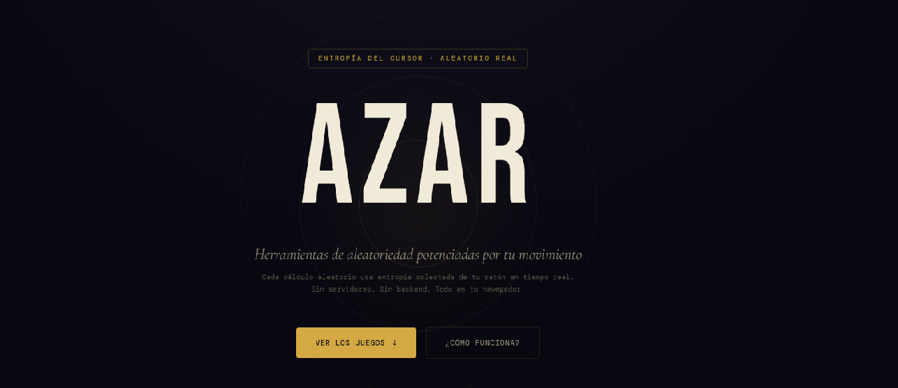

Azar es una suite de herramientas de aleatoriedad completamente estática, construida con Astro y Tailwind CSS. Su gran diferencia con otros generadores web es que no depende solo de Math.random(): aprovecha la entropía del usuario, la entropía del navegador y un pool interno que se alimenta de eventos reales.

Este artículo explica en detalle cómo funciona el algoritmo de Azar, por qué es mejor usarlo en este tipo de herramienta y qué hace cada parte del sistema.

## 1. Introducción: por qué Azar es distinto

La mayoría de las implementaciones de aleatoriedad en JavaScript se limitan a una línea:

```js
const r = Math.random();
```

Eso es suficiente para animaciones simples, pero no para casos donde queremos que el resultado esté influido por la interacción humana. En Azar, toda la lógica corre en el navegador del visitante, y el objetivo es capturar entropía real y mezclarla de forma segura.

### ¿Qué busca Azar?

- usar el movimiento del cursor como fuente de datos impredecibles
- capturar toques y movimiento de dispositivo en móviles
- usar el jitter natural de requestAnimationFrame
- combinarlo con Math.random() para mayor robustez
- exponer una API global `window.azarRandom()` que todas las herramientas usan

Azar no pretende reemplazar un generador criptográfico de clase mundial, pero sí añade calidad real frente a una solución puramente determinista basada en Math.random().

## 2. Arquitectura general del motor

El núcleo del motor está en `src/layouts/Layout.astro`, y se compone de tres bloques:

- el pool interno de entropía (`Uint32Array` de 256 elementos)
- la señal visual de entropía `azarSignal`
- la API pública `window.azarRandom()`

Todas las páginas y componentes del sitio usan esta misma API para generar resultados aleatorios.

### 2.1 Estructura del pool

Azar usa un buffer circular de 256 enteros sin signo:

```js
const POOL_SIZE = 256;
const pool = new Uint32Array(POOL_SIZE);
let poolIdx = 0;
```

Este pool no es solo almacenamiento: es el corazón de la mezcla. Cada evento relevante inyecta datos y cada generación consume valores del pool para producir números.

### 2.2 Función de mezcla xorMix

La función que mezcla valores internamente es un xorshift rápido:

```js
function xorMix(a: number): number {
  a ^= a << 13;
  a ^= a >> 17;
  a ^= a << 5;
  return a >>> 0;
}
```

Esta transformación no es un generador criptográfico independiente, pero sí es excelente para mezclar bits de forma eficiente.

Cada vez que se alimenta el pool, se hace así:

```js
function feedPool(v: number) {
  pool[poolIdx % POOL_SIZE] = xorMix(pool[poolIdx % POOL_SIZE] ^ (v | 0));
  poolIdx = (poolIdx + 1) % POOL_SIZE;
}
```

Ese `feedPool` combina el valor nuevo con el valor ya existente en la posición actual del pool, aplica la mezcla y avanza el puntero.

## 3. Las fuentes de entropía humana

Azar recoge entropía directa de la interacción del usuario. Estas son las fuentes principales:

### 3.1 `mousemove`

Cada movimiento del mouse contribuye con velocidad y coordenadas:

```js
document.addEventListener("mousemove", (e) => {
  const speed = Math.hypot(e.movementX, e.movementY);
  boostSignal(speed * 0.0045);
  feedPool((e.movementX * 137 + e.movementY * 59) | 0);
  feedPool((e.clientX ^ (e.clientY << 8)) | 0);
}, { passive: true });
```

Se usa `movementX` y `movementY` para capturar la dinámica del movimiento, y además se inyectan las coordenadas `clientX/clientY` en el pool.

### 3.2 `touchmove` y `touchstart`

En móviles, los toques son igual de valiosos:

```js
document.addEventListener("touchmove", (e) => {
  const t = e.touches[0];
  boostSignal(0.05);
  feedPool((t.clientX * 17 + t.clientY * 31) | 0);
  feedPool((performance.now() * 100) | 0);
}, { passive: true });

document.addEventListener("touchstart", () => {
  boostSignal(0.09);
  feedPool(performance.now() | 0);
}, { passive: true });
```

Los toques agregan coordenadas táctiles y tiempo, lo que es útil cuando no hay mouse.

### 3.3 `click`

Cada clic suma entropía adicional:

```js
document.addEventListener("click", (e) => {
  boostSignal(0.07);
  feedPool((e.clientX * 7 + e.clientY * 11) | 0);
}, { passive: true });
```

La idea es simple: cada interacción del usuario debe cambiar el estado interno del pool.

### 3.4 `devicemotion`

Los móviles con acelerómetro proporcionan datos físicos reales:

```js
if ("DeviceMotionEvent" in window) {
  window.addEventListener("devicemotion", (e) => {
    const a = e.acceleration;
    if (!a) return;
    const mag =
      Math.abs(a.x ?? 0) + Math.abs(a.y ?? 0) + Math.abs(a.z ?? 0);
    boostSignal(mag * 0.006);
    feedPool((mag * 1000) | 0);
  }, { passive: true });
}
```

El movimiento real del dispositivo introduce ruido que difícilmente puede ser predecible desde el lado del servidor.

## 4. Entropía de fondo: `requestAnimationFrame`

Incluso cuando el usuario está quieto, hay entropía disponible. El tiempo entre frames no es constante: depende de la CPU, el sistema operativo y otros procesos.

```js
let lastRaf = performance.now();
function rafLoop() {
  const now = performance.now();
  const diff = now - lastRaf;
  lastRaf = now;
  feedPool((diff * 100000) | 0);
  feedPool((now * 10000) | 0);
  requestAnimationFrame(rafLoop);
}
requestAnimationFrame(rafLoop);
```

Ese `diff` y el `now` son mediciones de jitter natural. No son completamente aleatorios, pero sí aportan ruido constante.

Este patrón está inspirado en técnicas de generación de entropía donde se usa el retardo de reloj o de ciclo para obtener bits impredecibles.

## 5. Señal visual: `azarSignal`

Azar no solo genera números; también muestra un HUD que indica la “cantidad de entropía activa”. Esa señal es útil para el usuario y para transmitir la idea de que el sistema está vivo.

El cálculo es este:

```js
const FLOOR = 0.08;
const CEILING = 1.0;
const DECAY_K = 0.975;
let signal = FLOOR;

function boostSignal(amount: number) {
  signal = Math.min(CEILING, signal + amount);
}

signal = Math.max(FLOOR, signal * DECAY_K + FLOOR * (1 - DECAY_K));
```

En otras palabras:

- hay un piso mínimo de 8%
- no se llega a 100%
- cada frame usa un decaimiento multiplicativo
- la señal sube con movimientos y toques

Eso produce una experiencia visual donde las acciones del usuario se traducen en una marca visible de energía aleatoria.

## 6. Generación final: cómo sale el número aleatorio

La función pública es `azarRandom()` y es la que usan todas las herramientas del sitio.

```js
function azarRandom(): number {
  let s = 0;
  const t = (performance.now() * 10000) | 0;
  for (let i = 0; i < 8; i++) s ^= pool[(poolIdx + i) % POOL_SIZE];
  s ^= t;
  s ^= t >>> 16;
  s = xorMix(s);
  pool[poolIdx % POOL_SIZE] = s;
  poolIdx = (poolIdx + 1) % POOL_SIZE;

  const humanEntropy = (s >>> 0) / 4294967296;
  const machineEntropy = Math.random();
  return (humanEntropy + machineEntropy) % 1;
}
```

Paso a paso:

- se extraen 8 valores del pool y se combinan con xor
- se mezcla con el tiempo actual (`performance.now()`)
- se transforma de nuevo con `xorMix`
- se guarda el valor resultante en el pool
- se normaliza a un número entre 0 y 1
- se suma con `Math.random()` y se aplica módulo 1

### ¿Por qué sumar `Math.random()`?

Porque aporta una fuente adicional del propio motor JS del navegador. Si por alguna razón la entropía del pool fuera baja, `Math.random()` refuerza el resultado.

La suma modular mantiene la distribución uniforme en el rango [0, 1).

## 7. Ventajas frente a `Math.random()` solo

### 7.1 Más variedad de fuentes

`Math.random()` depende del motor del navegador. Azar usa además:

- movimiento del mouse
- toques táctiles
- acelerómetro
- jitter de frames

### 7.2 Estado compartido

El pool interno acumula entropía entre eventos. Es decir, cada interacción altera un estado que persiste y se reutiliza.

### 7.3 Más difícil de predecir desde fuera

Un generador que solo usa `Math.random()` puede ser más fácil de inferir si el motor es conocido. Agregar la entropía del usuario hace que el resultado dependa de factores externos al navegador.

## 8. Dónde usa Azar esta API

Las herramientas del proyecto no generan números por su cuenta. Todas reclaman el mismo punto de acceso global:

- `src/components/tools/Sorteo.astro`
- `src/components/tools/Dados.astro`
- `src/components/tools/Cartas.astro`
- `src/components/tools/Numero.astro`
- `src/components/tools/Moneda.astro`
- `src/components/tools/Ruleta.astro`

Esto asegura consistencia: cualquier mejora en el motor se beneficia a todas las herramientas.

## 9. SEO y compartición social

Aunque el algoritmo es la parte técnica, Azar también cuida el SEO y la presencia social.

En `src/layouts/Layout.astro` hay metadatos como:

- canonical dinámico
- `og:image`
- `twitter:image`
- preload de `/preview.png`
- JSON-LD con `schema.org`

Esto mejora la calidad del sitio cuando se comparte en redes y también ayuda al rastreo de motores de búsqueda.

### Enlaces relacionados

- [Astro](https://astro.build/)
- [ Tailwind CSS](https://tailwindcss.com/)
- [MDN](https://developer.mozilla.org/es/docs/Web/JavaScript/Reference/Global_Objects/Math/random) `Math.random()`
- [MDN](https://developer.mozilla.org/es/docs/Web/API/Crypto/getRandomValues) `crypto.getRandomValues()`
- [schema.org](https://schema.org/WebApplication) WebApplication
- [`requestAnimationFrame`
](https://developer.mozilla.org/es/docs/Web/API/window/requestAnimationFrame)
## 10. Conclusión

Azar demuestra cómo un sitio estático puede ofrecer aleatoriedad de mejor calidad sin backend. En lugar de depender únicamente de un PRNG del navegador, combina:

- entropía humana real,
- jitter de hardware y sistema,
- mezcla interna de pool,
- y el propio `Math.random()`.

El resultado es un sistema apropiado para juegos, sorteos y herramientas de azar en el frontend.

Si quieres, puedo preparar otra versión enfocada en cómo integrar este motor en una librería independiente o cómo agregarlo fácilmente a otro proyecto Astro.

Puedes verlo en https://azar.devcito.org
