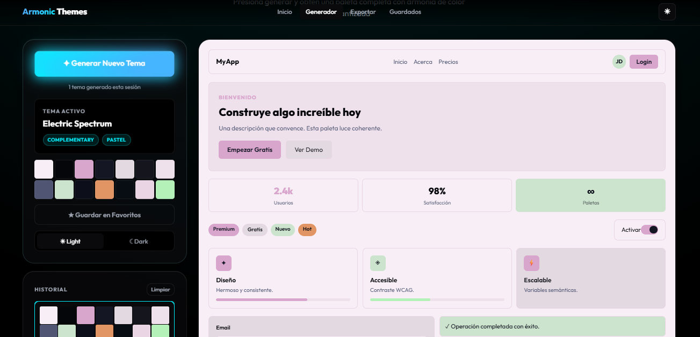

Una mirada técnica a cómo generar paletas que siempre se ven bien, en claro y en oscuro.



## El problema de las paletas "aleatorias"

Generar colores al azar es fácil. Generar colores al azar que se vean bien juntos es otro asunto completamente diferente.

La mayoría de los generadores de temas eligen cada color de forma independiente: un rojo por aquí, un azul por allá, un verde que nadie pidió. El resultado suele ser una paleta caótica donde los colores pelean entre sí en lugar de complementarse.

Armonic Themes resuelve esto con un principio fundamentalmente distinto.

## El principio fundamental: un solo hue lo gobierna todo

En lugar de elegir cada color de manera independiente, el algoritmo parte de un único Hue base (un ángulo en la rueda de color, entre 0° y 360°) y deriva todos los demás colores a partir de él usando relaciones matemáticas establecidas.

`Hue base aleatorio (0–360°)
        │
        ▼
┌─────────────────────┐
│ Estrategia de       │  → define secondaryHue y accentHue
│ armonía (al azar)   │
└─────────────────────┘
        │
        ▼
Todos los colores de la paleta`

Esto garantiza que, sin importar qué número salga, los colores siempre tendrán una relación armónica entre sí.

## Las estrategias de armonía

El algoritmo incluye 9 estrategias de armonía, elegidas al azar en cada generación:

- **Análoga**: Hues vecinos (±18°–55°) → Suave, elegante, "de diseñador"
- **Análoga amplia**: Vecinos más lejanos (±55°–160°) → Sofisticada, con más tensión
- **Complementaria**: Hue opuesto (+180°) → Alto contraste, energética
- **Triádica**: 3 hues a 120° entre sí → Rica, colorida, balanceada
- **Split-complementaria**: Vecinos del opuesto (+150° y +210°) → Contraste sin ser agresiva
- **Doble-split**: Ambos lados del opuesto (±150°) → Vibrante y simétrica
- **Tetrádica**: Cuadrado en la rueda (90° y 270°) → Máxima variedad de hues
- **Monocromática**: Mismo hue con mínima variación (±12°–18°) → Elegancia pura, una sola familia
- **Caótica**: Hues completamente libres → Máxima sorpresa, sin reglas

Por ejemplo, si el hue base es 220° (azul):

- Análoga → secondary ≈ 195°, accent ≈ 245°
- Complementaria → accent ≈ 40° (naranja)
- Triádica → secondary ≈ 340° (magenta), accent ≈ 100° (verde)

## Los Moods: la personalidad de cada paleta

La estrategia de armonía controla qué hues se usan. Pero el mood controla la saturación y luminosidad de cada color, que es lo que le da el "carácter" a la paleta.

El algoritmo define 17 moods, cada uno con rangos precisos de [min, max] para saturación (S) y luminosidad (L):

`- **bold** → primaryS: [52-82%], primaryL: [38-60%] — Firme, seguro
- **soft** → primaryS: [28-58%], primaryL: [52-74%] — Suave, amable
- **vibrant** → primaryS: [74-100%], primaryL: [44-64%] — Eléctrico, vivo
- **pastel** → primaryS: [38-72%], primaryL: [68-87%] — Dulce, delicado
- **neon** → primaryS: [88-100%], primaryL: [52-68%] — Extremo, digital
- **jewel** → primaryS: [62-92%], primaryL: [22-42%] — Esmeralda, zafiro, rubí
- **mono** → primaryS: [4-18%],  primaryL: [18-52%] — Casi escala de grises
- **midnight** → primaryS: [48-82%], primaryL: [48-72%] — Nocturno, intenso
- **corporate** → primaryS: [22-52%], primaryL: [26-50%] — Profesional, sobrio
- ... y más`

La combinación de estrategia de armonía + mood produce miles de paletas visualmente coherentes sin intervención manual.

## La micro-variación: el toque de aleatoriedad controlada

Para que dos paletas con el mismo mood y estrategia no sean idénticas, el algoritmo aplica un multiplicador global de saturación y luminosidad en cada generación:

```js
const satTwist = rand(0.72, 1.32);  // Amplifica o reduce TODA la saturación
const litTwist = rand(0.92, 1.08);  // Pequeña variación de luminosidad global
```

Un `satTwist` de 1.32 hace que todos los colores sean un 32% más saturados que lo normal para ese mood. Uno de 0.72 los apaga. Esto produce una variedad enorme dentro de la misma "familia" de paletas.

## Accesibilidad automática: WCAG sin esfuerzo

Uno de los detalles más cuidados del algoritmo es que nunca hay que definir manualmente el color del texto. Cada foreground se calcula automáticamente usando la fórmula de luminancia relativa de las directrices WCAG 2.1:

```js
Luminancia relativa = 0.2126·R + 0.7152·G + 0.0722·B
```

Si la luminancia del fondo supera 0.179 (umbral perceptual donde el ojo empieza a ver el color como "claro"), el texto se vuelve oscuro. Si está por debajo, se vuelve claro. Ambas variantes tienen un tinte sutil del hue base o secundario para que no sean un gris muerto:

```js
// Fondo claro → texto oscuro teñido
{ h: darkTintHue, s: rand(15, 45), l: rand(2, 12) }

// Fondo oscuro → texto claro teñido  
{ h: lightTintHue, s: rand(5, 25), l: rand(92, 98) }
```

El resultado es que todo texto generado cumple contraste legible de manera automática, y aun así los textos tienen personalidad cromática propia.

## Cómo funciona el modo oscuro

Aquí está la magia. En lugar de "invertir" los colores o usar un overlay semitransparente (como hacen muchos frameworks), el algoritmo genera ambos modos desde el principio, compartiendo los mismos hues pero con `lightness` completamente diferente.

### Lo que se comparte entre light y dark

El color `primary`, `destructive` y `ring` son idénticos en ambos modos. Son los colores de acción y tienen su propio contraste garantizado.

### Lo que cambia entre light y dark

- `background` → light L: 93–99% (casi blanco), dark L: 2–13% (casi negro)
- `muted` → light L: 86–96% (blanco grisáceo), dark L: 11–26% (gris oscuro)
- `border` → light L: 75–91% (gris claro), dark L: 23–45% (gris medio oscuro)
- `secondary` → saturación mínima, L alta / saturación mínima, L baja
- `accent` → saturación media, L alta / saturación media, L baja

Y aquí viene el detalle que hace que los modos oscuros tengan personalidad: los fondos oscuros no usan necesariamente el mismo hue que los fondos claros.

```js
// Para el fondo oscuro, se elige un darkTintHue con más libertad:
const darkTintCandidates = [baseHue, secondaryHue, accentHue, rand(200, 260), rand(140, 180)];
const darkTintHue = Math.random() > 0.35
  ? darkTintCandidates[randInt(0, darkTintCandidates.length - 1)]
  : baseHue;
```

Esto significa que el fondo oscuro puede tener un tinte azul profundo aunque el color primario sea naranja. Es lo que evita que todos los modos oscuros sean "gris neutro con colores encima".

## El flujo completo en 12 pasos

`1. Elegir HUE BASE (0–360°)
2. Elegir ESTRATEGIA DE ARMONÍA → calcular `secondaryHue` y `accentHue`
2.5 Elegir MOOD → rangos S/L para cada token
3. Aplicar micro-variación (`satTwist`, `litTwist`)
4. Generar PRIMARY (hue base + rangos del mood)
5. Generar SECONDARY en versión base / light / dark
6. Generar ACCENT en versión light / dark
7. Generar DESTRUCTIVE (siempre en zona de rojos, 330–30°)
8. Elegir `darkTintHue` y `lightTintHue` para los fondos
9. Generar BACKGROUND light (L: 93–99%) y dark (L: 2–13%)
10. Generar MUTED light y dark
11. Generar BORDER light y dark
12. Calcular todos los FOREGROUNDS por luminancia WCAG automática`

## Nombrar cada paleta

Para que cada tema sea memorable, el algoritmo genera nombres combinando dos listas de palabras:

`[Arctic, Velvet, Neon, Cosmic, Ember, Frosted...] + [Dawn, Wave, Pulse, Storm, Bloom...]`

→ "Arctic Dawn", "Velvet Pulse", "Cosmic Storm"

Son 70+ adjetivos × 70+ sustantivos = más de 4,900 combinaciones posibles, todas con ese sabor evocador de los nombres de temas de código.

## En resumen

Lo que hace especial a este algoritmo es que la aleatoriedad está estructurada. Nada se elige de forma verdaderamente libre: el azar actúa dentro de rangos matemáticamente definidos, siguiendo relaciones de color probadas durante décadas de teoría del diseño.

El resultado es un generador que puede producir miles de paletas distintas, cada una coherente y usable desde el primer intento, con modo claro y oscuro listos para producción.

Escrito analizando el código fuente de `color-algorithm.js` del proyecto Armonic Themes.

Puedes verlo en https://themes.devcito.org
