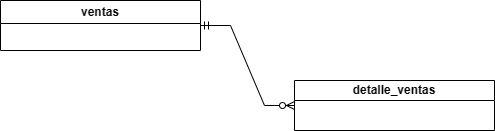
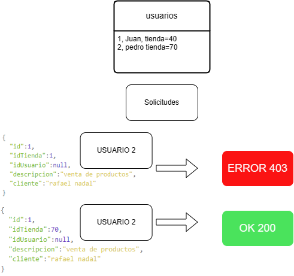
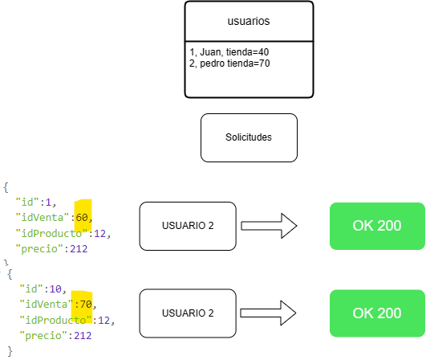
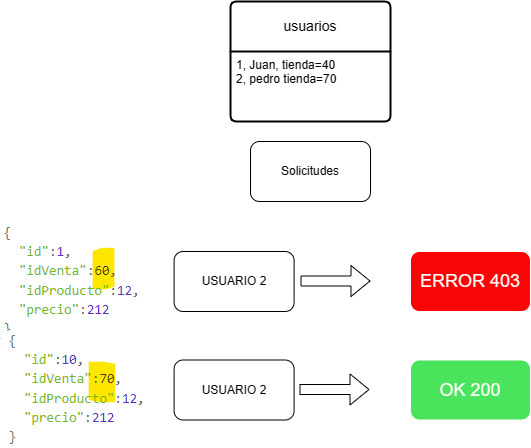
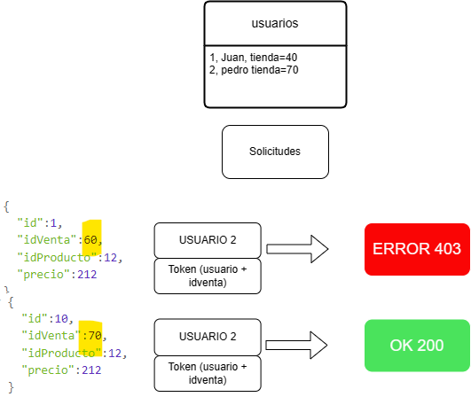
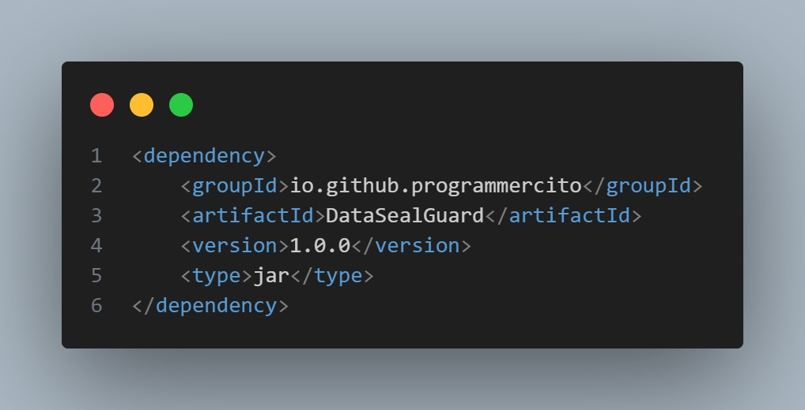
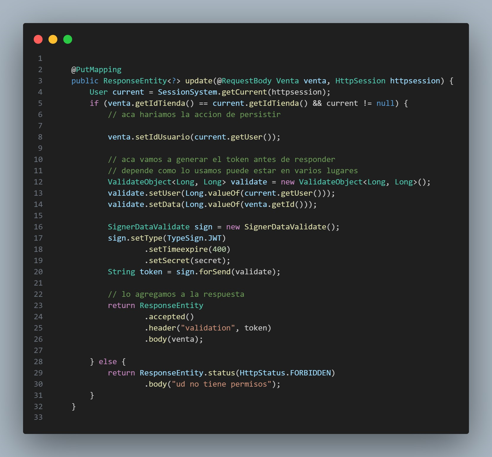
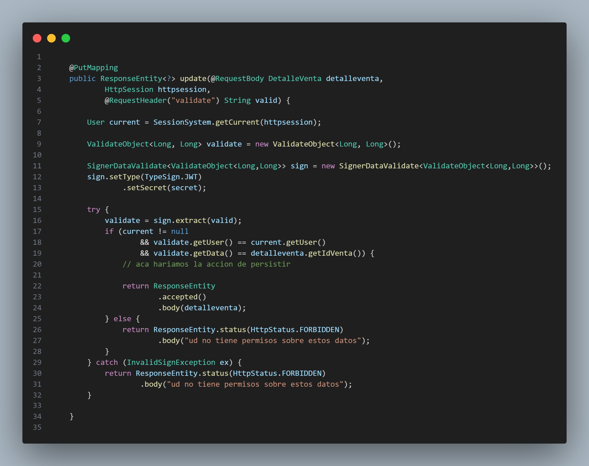

When we, as programmers, need to ensure acceptable security in our applications, we face challenges such as validations where we must prevent users from modifying data that doesn't belong to them and for which they don't have permissions.

We have frameworks, languages, and libraries that allow us, through roles, permissions, tokens, sessions, and others, to secure our developments, at least on the application side. However, there are validations that these tools don't cover. I'm talking about validating the internal logic of the application when entering data into a table. For instance, let's describe a case where it's easy to validate a set of data and another case where it's more complex and difficult to efficiently validate, especially when there's more than one detail or even a chain of tables.

## Case Study

We have two tables: a "sales" table and a "sales_detail" table. Users can enter, modify, and sell data, but only in the "store" where they work. Therefore, we would assume some fields as follows:

## Sales Table

- Id (sequential)
- store_id
- user
- description
- client

## Sales Detail Table

- Id (sequential)
- sale_id
- product_id
- price

(Where sale_id is a Foreign Key with the Sales table)

## Security Requirements

- Users should only be able to add sales from the store where they are working.
- Users should only be able to add details from the store where they are working.

## Solutions for the Sales Table

Considering that there are user data in some authentication and authorization medium when calling our endpoint, a simple solution is to compare the storeid of the table against the storeid or the allowedid for the session user. If they match or are on this list, allow the sale record to be saved in the table.

This is common to do; sometimes developers forget, a problem that increases more in a REST architecture where requests don't depend on anything prior to being executed. Likewise, these types of validations that contrast the table's storeid against the user's permissions are simple to do, and we could do it against more ids and more tables for a more complex validation.

Figure: Validation of the store entered with the user's store, all the data needed for validation is available.

## Solutions for the Sales Detail Table

Figure: Any sale is valid, even if it's not from your store, creating a security hole in the application.

In this table, validations become a bit more complex since, although we still have or always have user data and their allowed stores, what we don't have is the store_id of the sales table. Generally, the reality is that the developer is more focused on ensuring that their module or development works correctly and, not seeing this problem, either underestimates or omits it. However, it can be a significant security problem considering the following:

In the salesdetail table, the user could enter a saleid from another store that doesn't belong to them. However, if they entered closed sales whose totals were already calculated and processed, it might not be taken into account by a state machine. But if they entered a sale_id from another store that is being processed, they could sell a product without the client even realizing that they are being sold more, or even worse, remove a product, or modify the quantity of products, causing problems with sales, stores, sellers, and many more issues.

To address this, we have logical solutions to perform consistent validation, some of which we detail below:

To validate, and since we don't have the id of the sales table in the detail, what we could do is go against the master table and get the id to, once we have it, validate in the same way as with the master table. However, if we have a larger or more massive number of details, the number of calls to the master table to do this validation could cause system slowness. However, for small systems, it's a logical validation and not very complex in reality.

Another alternative would be to return to the fields to validate in this case storeid as part of the fk key that is sent in the request and is automatically validated with the database for its existence and also validated against the session, the same as was done in the master table. This option would be the most feasible, but it would require that the ids to validate in this case the storeid were part of the FK key along with the detail id, ensuring that the validation against the stores with which the user has permission is made before entering the table.

But what happens if we are forced from the design to comply with rules like normalization that wouldn't allow us to keep the fields in each table, and what happens if there are more details of the details in a chain, the redundancy of the data would be much greater than two tables, then we have to resort to another type of validations, here we come with my solution proposal, a solution that I consider more in line with large and scalable systems.

Figure: If validated, an error 403 is triggered because that sale doesn't belong to your assigned store.

## Proposed Solution

The proposed solution avoids going to the database to make the query in what could be a large table, although it involves some processing, but without the use of queries or other things, it should cost much less than other solutions, making it a better solution than the others.

For this, we will use a token that contains the information of the id of the record that this user has access to, that is, the saleid where they have already entered, in some other cases they could have other ids that would vary according to the type of validation we want to perform, for this case this signed token must contain the saleid and the user id together and signed to be able to validate the user who has permission to the sale detail and can allow operations, this use could also have variations of states or operations on the table but for our example, it would only have the general information of the sale as well as the user so that it doesn't serve more users.

For the token, we have two options that we could use, so that the client sends with the request and it would depend on the user to see which one to use:

- JWT

- HMAC

A JWT would have the advantage of having expiration dates, other extra algorithm data, the possibility of sending more data, and as a disadvantage the verification of the signature that would take a little longer than an HMAC but its versatility would give us advantages of more uses or combine other data to validate for extra logic.

An HMAC can send any data, and the hash is the signature to verify, these data could be used for validation, however, the token serves forever so the table would have to have some protection mechanism to prevent more data from being entered for that sale and the client forgets the token for greater security.

In our case study, we can use either of the two, JWT is the most known and our choice in this case that will be generated once the data is created in the master Sales table and saved by the client in a safe place, when the client requires sending data from the detail table.

## Steps to follow to send data to the table with validation:

1. Once the client requires performing actions on the "sales_detail" table, they send the token along with the request as a header (in cases like forms they could send it as a hidden field if it's not an object or a body).

2. Once on the server, the backend should verify the token signature.

3. If the signature is valid, the backend will decode the data sent in the token to a verifiable format.

4. The data is verified and compared with

the data sent and with the session data, in this case, verify that the saleid is the same as the saleid sent in the body and the userid compared with the userid of the session or the authorization method used.

5. If everything verified is correct, then the requested action can be performed by the used endpoint, in this example case, use the insert into the table.

6. If any of the validations fail, then the endpoint will issue a security error and that the permissions are wrong.

As you can see, this will prevent users from being able to edit, create, or delete information from other stores, as well as depending on how the validation is also preventing information from already closed sales from being entered, as in the use of JWT automatically since the generated JWTs would already be expired when the sale is closed, logic that the developer will have to see which is the best and which gives him more security.

Figure: Solution with a token that includes the missing information for validation; it is considered valid since it is signed at the moment it is validated in the master table.

## Library Solution

To solve this problem more simply, a library has been built in Java to help perform these types of validations with the following features:

- Generates the token with the information to be validated.

- Easily choose between the two types of tokens (JWT and HMAC).

- Configure the algorithm in the case of using JWT.

- Validate the integrity of the token.

- Retrieve the data for its validation.

To use the library with Maven:

Token Generation

Here we have the example of how it could be generated and responded in a header to be read by the client:

As you can see, the user and the sale to the detail will be sent signed, where as it is signed it will be assumed that there is permission on this sale. Bearing in mind that the storeid should also be validated, it is guaranteed that this saleid can be edited.

Token Validation

The example shows how the token would be retrieved from the headers sent by the client and a basic validation:

The library will save us the time of writing code to generate and validate the token, as well as retrieve the data to validate easily. With all this, we have been able to overcome a major security problem when developing that we often don't take into account or solve in other ways or directly by having large teams some don't take it into account and that can cause major problems in the future if a user or a hacker manages to exploit this problem, although with a different design, for example, having large and alphanumeric keys, the most optimal are always sequential, and with these tokens, we can protect any endpoint.

References

Libreria en maven

[Maven Central: io.github.programmercito:DataSealGuard (sonatype.com)](https://central.sonatype.com/artifact/io.github.programmercito/DataSealGuard)

Código fuente de la librería

[Programmercito/datasealguard-java (github.com)](https://github.com/Programmercito/datasealguard-java)

Perfil de github

[Programmercito (Programmercito) (github.com)](https://github.com/Programmercito)

Repositorio de ejemplos

[Programmercito/datasealguard-java-examples (github.com)](https://github.com/Programmercito/datasealguard-java-examples)
